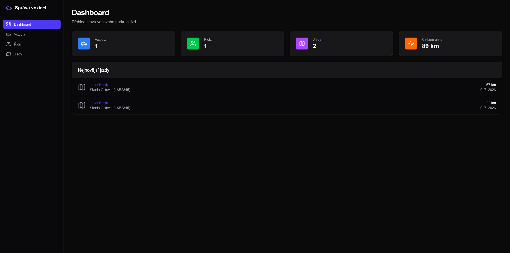
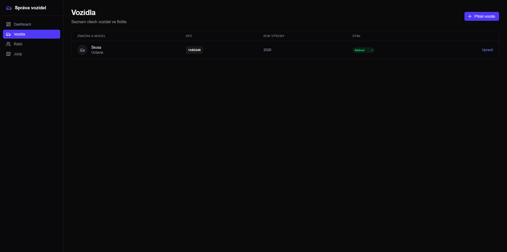
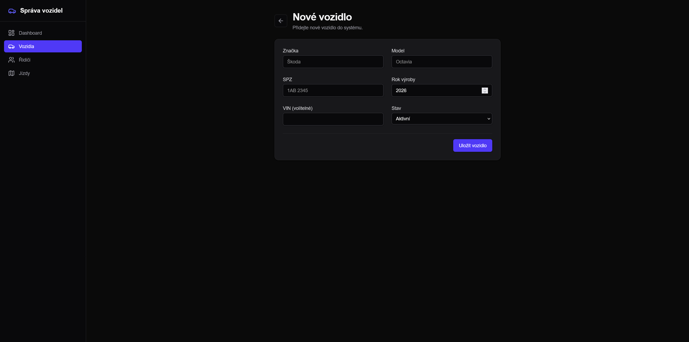
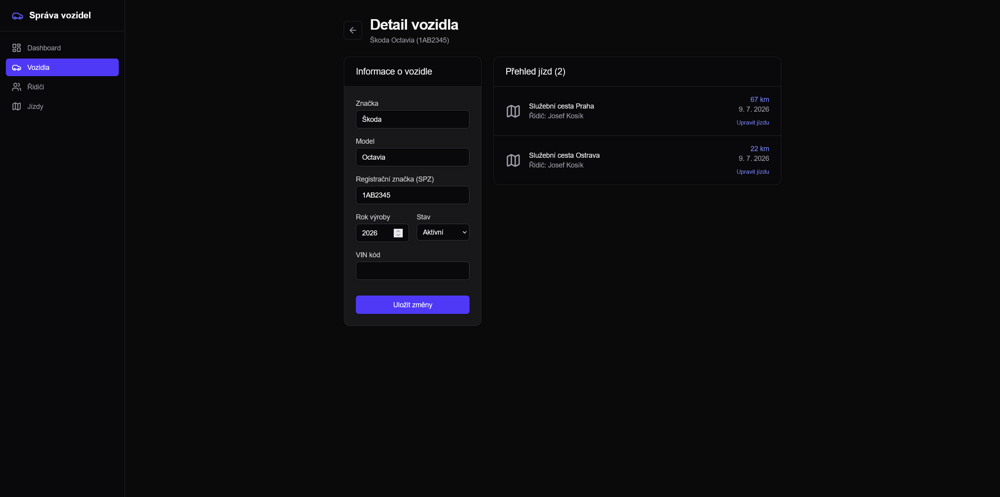
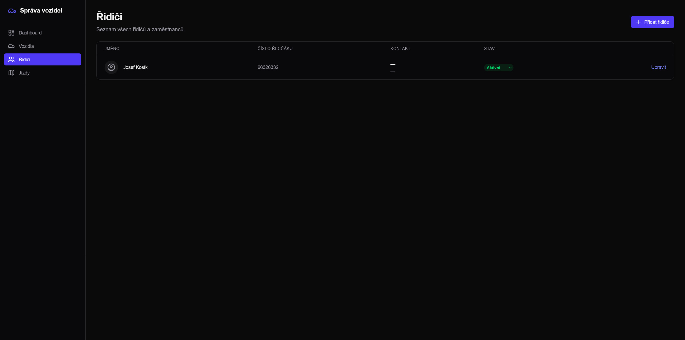
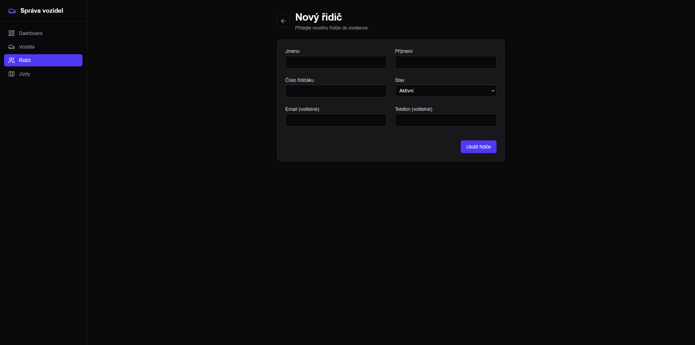
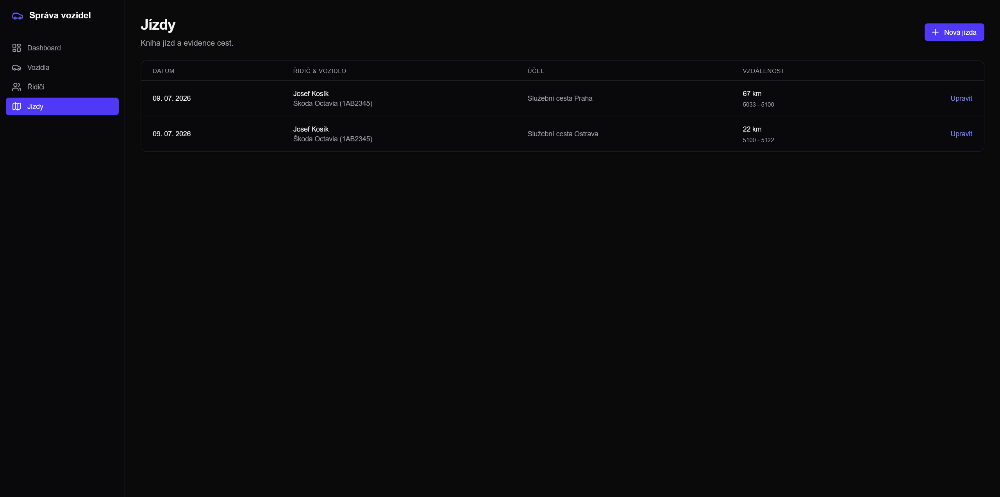
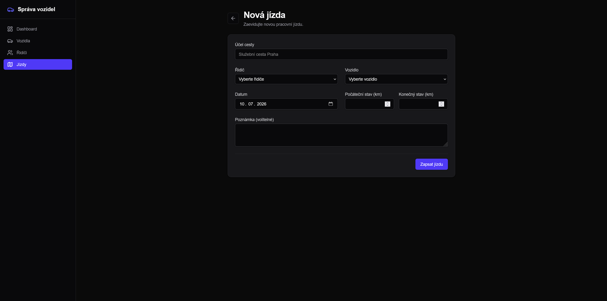

# Správa vozového parku
- Správa vozidel, jízd a řidičů

## Instalace aplikace
- Pro spuštění aplikace potřebujeme nainstalovat balíčky
```bash
npm install
```

- Pro spuštění aplikace potřebujeme vytvořit .env soubor, kde zadáme umístění souboru pro databázi:

```env
# ./dev.db is created example
DATABASE_URL="file:./dev.db"
```

## Vývojářské spuštění
- Pro vygenerování prisma schema na clienta, můžete použít následující příkaz
```bash
npx prisma generate
```

- Pro spuštění projektu můžete použít následující příkaz

```bash
npm run dev
```

- A aplikace se spustí na odkazu: [http://localhost:3000](http://localhost:3000)

## Fotky aplikace







